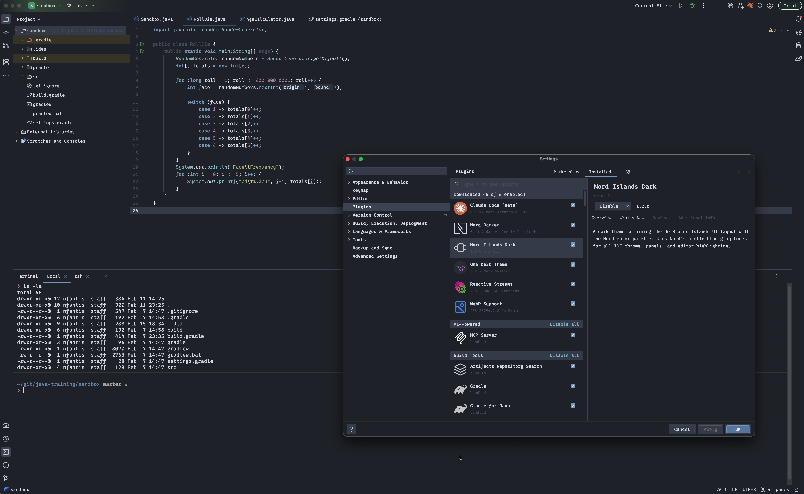

# Nord Islands Dark

A dark theme for JetBrains IDEs combining the [Islands UI](https://plugins.jetbrains.com/docs/intellij/themes-getting-started.html) layout with the [Nord](https://www.nordtheme.com/) color palette. Uses Nord's arctic blue-gray tones for all IDE chrome, panels, and editor highlighting.



## Color Palette

| Category        | Purpose      | Colors                                                            |
|-----------------|--------------|-------------------------------------------------------------------|
| **Polar Night** | Backgrounds  | `#21252D` `#3B4252` `#434C5E` `#4C566A`                          |
| **Snow Storm**  | Foregrounds  | `#D8DEE9` `#E5E9F0` `#ECEFF4`                                    |
| **Frost**       | Accents      | `#8FBCBB` `#88C0D0` `#81A1C1` `#5E81AC`                          |
| **Aurora**      | Highlights   | Red `#BF616A` Orange `#D08770` Yellow `#EBCB8B` Green `#A3BE8C` Purple `#B48EAD` |

## Features

- **Full UI theming** -- buttons, menus, toolbars, tabs, panels, popups, and all other IDE components
- **Editor syntax highlighting** -- keywords, strings, comments, functions, classes, and 30+ token types
- **VCS integration** -- file status colors, diff/merge highlighting, and blame annotations
- **Terminal colors** -- complete ANSI palette (16 standard + 16 bright)
- **Rainbow brackets** -- four distinct bracket colors for easy nesting visibility
- **Search & navigation** -- styled search results, inline hints, and TODO highlights

## Requirements

- JetBrains IDE **2024.3** or later (IntelliJ IDEA, WebStorm, PyCharm, etc.)
- Java 21

## Building from Source

**Java 21 is required.** Gradle must be configured to use JDK 21. If your default JDK is a different version, either:

- Set `JAVA_HOME` to your JDK 21 installation, or
- Add `org.gradle.java.home = /path/to/jdk-21` to `gradle.properties`

```bash
# Build the plugin
./gradlew build

# Run in an IDE sandbox for testing
./gradlew runIde

# Package for distribution
./gradlew buildPlugin
```

The distributable plugin ZIP will be in `build/distributions/`.

## Installation

### From disk

1. Build the plugin (see above) or download the ZIP from [Releases](#).
2. In your JetBrains IDE, go to **Settings > Plugins > Gear icon > Install Plugin from Disk...**
3. Select the ZIP file and restart the IDE.
4. Go to **Settings > Appearance & Behavior > Appearance** and select **Nord Islands Dark**.

## Project Structure

```
src/main/resources/
├── META-INF/
│   └── plugin.xml                    # Plugin descriptor
└── themes/
    ├── NordIslandsDark.theme.json    # UI theme (IDE chrome)
    └── NordIslandsDark.xml           # Editor color scheme
```

## License

MIT -- see [LICENSE](LICENSE) for details.
