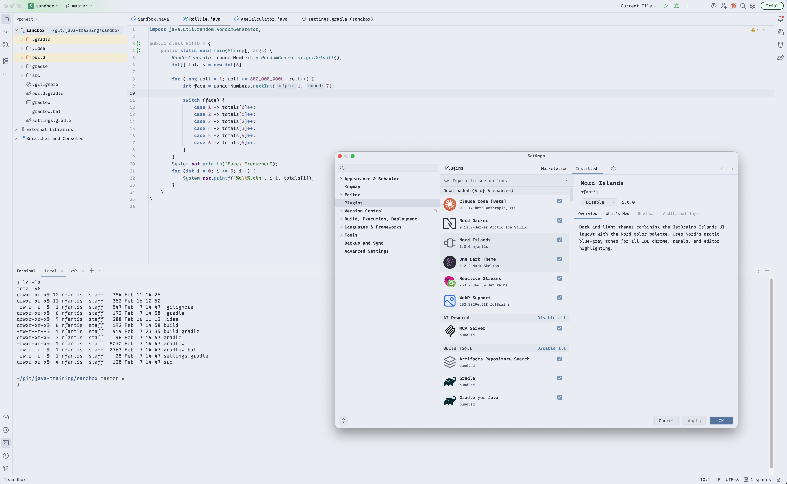
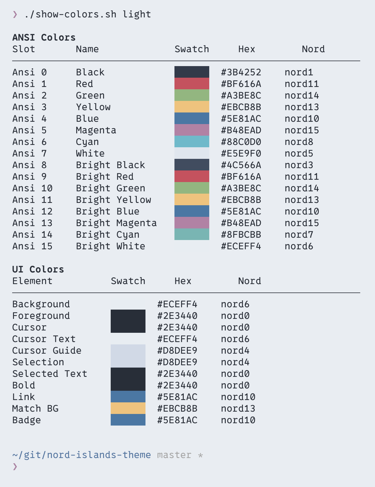

# Nord Islands

Dark and light themes combining the [Nord](https://www.nordtheme.com/) color palette with a deeper background for improved contrast. Includes themes for [JetBrains IDEs](https://plugins.jetbrains.com/docs/intellij/themes-getting-started.html) (Islands UI), [VS Code](https://code.visualstudio.com/), [btop](https://github.com/aristocratos/btop), and [iTerm2](https://iterm2.com/).

## Nord Islands Dark


Uses the **Polar Night** palette for backgrounds with **Snow Storm** foregrounds, creating a deep arctic dark theme.

## Nord Islands Light



Uses the **Snow Storm** palette for backgrounds with **Polar Night** foregrounds, emphasizing the **Frost** accent colors for a clean, cool light theme.

## Color Palette

| Category        | Purpose                | Dark Theme Role | Light Theme Role |
|-----------------|------------------------|-----------------|------------------|
| **Polar Night** | `#2E3440` `#3B4252` `#434C5E` `#4C566A` | Backgrounds | Foregrounds |
| **Snow Storm**  | `#D8DEE9` `#E5E9F0` `#ECEFF4`           | Foregrounds | Backgrounds |
| **Frost**       | `#8FBCBB` `#88C0D0` `#81A1C1` `#5E81AC` | Accents     | Accents     |
| **Aurora**      | Red `#BF616A` Orange `#D08770` Yellow `#EBCB8B` Green `#A3BE8C` Purple `#B48EAD` | Highlights | Highlights |

### Differences from Official Nord

15 of the 16 [official Nord colors](https://www.nordtheme.com/docs/colors-and-palettes) are used exactly as specified. The one intentional change is the dark theme's primary background (`polarNight0`), which is darkened from `#2E3440` to `#21252D` for deeper contrast. The light theme uses the official Snow Storm values unmodified.

A few additional colors not in the official palette are used where needed:

- `#616E88` / `#8790A3` for comments (dark / light) -- widely adopted convention across Nord editor ports, sitting between nord3 and nord4 in brightness.
- `#33394A` / `#E0E5EE` for injected/template language backgrounds -- custom shades blending into the Polar Night / Snow Storm ranges.
- Tinted Aurora blends for subtle UI backgrounds like error banners and diff highlights (darkened for dark theme, lightened for light theme).

## Features

- **Full UI theming** -- buttons, menus, toolbars, tabs, panels, popups, and all other IDE components
- **Editor syntax highlighting** -- keywords, strings, comments, functions, classes, and 30+ token types
- **VCS integration** -- file status colors, diff/merge highlighting, and blame annotations
- **Terminal colors** -- complete ANSI palette (16 standard + 16 bright)
- **Rainbow brackets** -- four distinct bracket colors for easy nesting visibility
- **Search & navigation** -- styled search results, inline hints, and TODO highlights

## Requirements

- JetBrains IDE **2024.3** or later (IntelliJ IDEA, WebStorm, PyCharm, etc.)
- Java 21

## Building from Source

**Java 21 is required.** Gradle must be configured to use JDK 21. If your default JDK is a different version, either:

- Set `JAVA_HOME` to your JDK 21 installation, or
- Add `org.gradle.java.home = /path/to/jdk-21` to `gradle.properties`

```bash
# Build the plugin
./gradlew build

# Run in an IDE sandbox for testing
./gradlew runIde

# Package for distribution
./gradlew buildPlugin
```

The distributable plugin ZIP will be in `build/distributions/`.

## Installation

### From disk

1. Build the plugin (see above) or download the ZIP from [Releases](#).
2. In your JetBrains IDE, go to **Settings > Plugins > Gear icon > Install Plugin from Disk...**
3. Select the ZIP file and restart the IDE.
4. Go to **Settings > Appearance & Behavior > Appearance** and select **Nord Islands Dark** or **Nord Islands Light**.

## VS Code Themes

Standalone color theme files for [Visual Studio Code](https://code.visualstudio.com/) are included for both variants:

- [`nord-islands-dark-color-theme.json`](vscode/nord-islands-dark-color-theme.json) -- dark background (`#21252D`)
- [`nord-islands-light-color-theme.json`](vscode/nord-islands-light-color-theme.json) -- light background (`#ECEFF4`)

All colors are mapped 1:1 from the JetBrains themes, covering full workbench UI, syntax highlighting (~50 token rules), semantic token colors, terminal ANSI palette, git decorations, diff/merge, debug, and minimap.

### Installation

1. Create a local extension directory:

   ```bash
   mkdir -p ~/.vscode/extensions/nord-islands-theme/themes
   ```

2. Copy the theme files:

   ```bash
   cp vscode/nord-islands-dark-color-theme.json ~/.vscode/extensions/nord-islands-theme/themes/
   cp vscode/nord-islands-light-color-theme.json ~/.vscode/extensions/nord-islands-theme/themes/
   ```

3. Create a minimal `package.json` in the extension directory:

   ```bash
   cat > ~/.vscode/extensions/nord-islands-theme/package.json << 'EOF'
   {
     "name": "nord-islands-theme",
     "displayName": "Nord Islands Theme",
     "version": "1.0.0",
     "engines": { "vscode": "^1.60.0" },
     "categories": ["Themes"],
     "contributes": {
       "themes": [
         {
           "label": "Nord Islands Dark",
           "uiTheme": "vs-dark",
           "path": "./themes/nord-islands-dark-color-theme.json"
         },
         {
           "label": "Nord Islands Light",
           "uiTheme": "vs",
           "path": "./themes/nord-islands-light-color-theme.json"
         }
       ]
     }
   }
   EOF
   ```

4. Restart VS Code, then open **Settings > Color Theme** and select **Nord Islands Dark** or **Nord Islands Light**.

## btop Themes

Theme files for [btop](https://github.com/aristocratos/btop) are included for both variants:

- [`nord-islands-dark.theme`](btop/nord-islands-dark.theme) -- dark background (`#21252D`)
- [`nord-islands-light.theme`](btop/nord-islands-light.theme) -- light background (`#ECEFF4`)

Unlike the built-in Nord btop theme (which uses the same blue-to-white gradient for every metric), Nord Islands uses **distinct, semantically meaningful gradients** leveraging the full Aurora and Frost palettes:

| Metric | Gradient | Rationale |
|--------|----------|-----------|
| Temperature | Green → Yellow → Red | Intuitive cool-to-hot |
| CPU | Deep Blue → Blue → Cyan | Frost palette progression |
| Free memory | Green → Teal → Cyan | Green = available |
| Used memory | Orange → Yellow → Red | Warm = resource pressure |
| Download | Teal → Cyan → Blue | Cool tones for inbound |
| Upload | Purple → Orange → Yellow | Warm tones for outbound |

Each box section (CPU, Memory, Network, Processes) also has a distinct outline color for easy identification.

### Installation

1. Copy the theme file to your btop themes directory:

   ```bash
   # Create the directory if it doesn't exist
   mkdir -p ~/.config/btop/themes

   # Copy one or both themes
   cp btop/nord-islands-dark.theme ~/.config/btop/themes/
   cp btop/nord-islands-light.theme ~/.config/btop/themes/
   ```

2. In btop, press `Esc` to open the menu, select **Options**, and choose **nord-islands-dark** or **nord-islands-light** from the color theme list.

## iTerm2 Themes

iTerm2 color profiles are included for both variants:

- [`Nord_Islands_Dark.itermcolors`](iterm/Nord_Islands_Dark.itermcolors) -- dark background (`#21252D`)
- [`Nord_Islands_Light.itermcolors`](iterm/Nord_Islands_Light.itermcolors) -- light background (`#ECEFF4`)




### Installation

1. Open iTerm2 and go to **Settings > Profiles > Colors**.
2. Click **Color Presets... > Import...** and select the `.itermcolors` file.
3. Select **Nord Islands Dark** or **Nord Islands Light** from the Color Presets dropdown.

## Project Structure

```
btop/
├── nord-islands-dark.theme            # btop dark theme
└── nord-islands-light.theme           # btop light theme
iterm/
├── Nord_Islands_Dark.itermcolors      # iTerm2 dark profile
└── Nord_Islands_Light.itermcolors     # iTerm2 light profile
vscode/
├── nord-islands-dark-color-theme.json # VS Code dark theme
└── nord-islands-light-color-theme.json # VS Code light theme
src/main/resources/
├── META-INF/
│   └── plugin.xml                    # Plugin descriptor
└── themes/
    ├── NordIslandsDark.theme.json    # Dark UI theme (IDE chrome)
    ├── NordIslandsDark.xml           # Dark editor color scheme
    ├── NordIslandsLight.theme.json   # Light UI theme (IDE chrome)
    └── NordIslandsLight.xml          # Light editor color scheme
```

## License

MIT -- see [LICENSE](LICENSE) for details.
